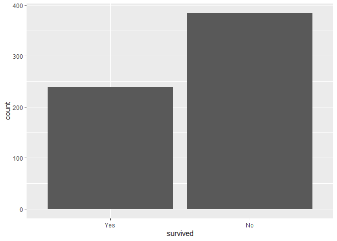
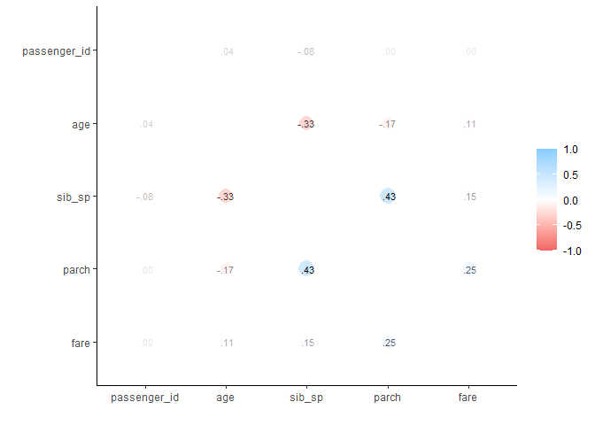
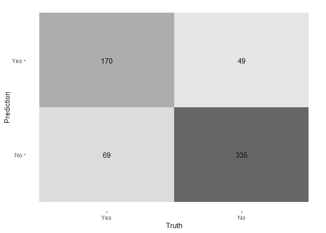
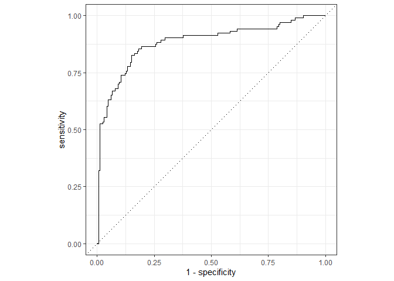

## Classification

For this assignment, we will be working with part of a [Kaggle data set](https://www.kaggle.com/c/titanic/overview) that was the subject of a machine learning competition and is often used for practicing ML models. The goal is classification; specifically, to predict which passengers would survive the [Titanic shipwreck](https://en.wikipedia.org/wiki/Titanic).

{width="363"}

Load the data from `data/titanic.csv` into *R* and familiarize yourself with the variables it contains using the codebook (`data/titanic_codebook.txt`).

Notice that `survived` and `pclass` should be changed to factors. When changing `survived` to a factor, you may want to reorder the factor so that *"Yes"* is the first level.

Make sure you load the `tidyverse` and `tidymodels`!

*Remember that you'll need to set a seed at the beginning of the document to reproduce your results.*


### Question 1

Split the data, stratifying on the outcome variable, `survived.`  You should choose the proportions to split the data into. Verify that the training and testing data sets have the appropriate number of observations. Take a look at the training data and note any potential issues, such as missing data.

Why is it a good idea to use stratified sampling for this data?

```r
set.seed(3435)
titanic_split <- initial_split(titanic, prop = 0.70, strata = 'survived')
titanic_train <- training(titanic_split)
titanic_test <- testing(titanic_split)
```
Stratified sampling is the best choice among the probability sampling methods when you believe that subgroups will have different mean values for the variables you’re studying. It has several potential advantages: A stratified sample includes subjects from every subgroup, ensuring that it reflects the diversity of your population. Since this data in particular has multiple ways of creating subgroups of people, stratifying the data is a good idea.

### Question 2

Using the **training** data set, explore/describe the distribution of the outcome variable `survived`.

```r
titanic_train %>% 
  ggplot(aes(x = survived)) +
  geom_bar()
```

<!-- -->
About 40% of the observation in the **training** data set survived.

### Question 3

Using the **training** data set, create a correlation matrix of all continuous variables. Create a visualization of the matrix, and describe any patterns you see. Are any predictors correlated with each other? Which ones, and in which direction?

```r
cor_titanic_train <- titanic_train %>%
  select(passenger_id, age, sib_sp, parch, fare) %>%
  correlate()
rplot(cor_titanic_train, print_cor = TRUE)
```

<!-- -->
Positively Weak Correlation: (fare, parch), (parch, sib_sp)
Negatively Weak Correlation: (sib_sp, age)

### Question 4

Using the **training** data, create a recipe predicting the outcome variable `survived`. Include the following predictors: ticket class, sex, age, number of siblings or spouses aboard, number of parents or children aboard, and passenger fare.

Recall that there were missing values for `age`. To deal with this, add an imputation step using `step_impute_linear()`. Next, use `step_dummy()` to **dummy** encode categorical predictors. Finally, include interactions between:

-   Sex and passenger fare, and
-   Age and passenger fare.

You'll need to investigate the `tidymodels` documentation to find the appropriate step functions to use.

```r
titanic_train_recipe <- recipe(survived ~ pclass + sex + age + sib_sp + parch + fare, data = titanic_train) %>%
  step_impute_linear(age) %>%
  step_dummy(sex) %>%
  step_interact(terms ~ starts_with('sex'):fare + age:fare)
```

### Question 5

Specify a **logistic regression** model for classification using the `"glm"` engine. Then create a workflow. Add your model and the appropriate recipe. Finally, use `fit()` to apply your workflow to the **training** data.

***Hint: Make sure to store the results of `fit()`. You'll need them later on.***

```r
log_reg <- logistic_reg() %>% 
  set_engine("glm") %>% 
  set_mode("classification")

log_wkflow <- workflow() %>% 
  add_model(log_reg) %>% 
  add_recipe(titanic_train_recipe)

log_fit <- fit(log_wkflow, titanic_train)
log_fit
```

```
## == Workflow [trained] ==========================================================
## Preprocessor: Recipe
## Model: logistic_reg()
## 
## -- Preprocessor ----------------------------------------------------------------
## 3 Recipe Steps
## 
## * step_impute_linear()
## * step_dummy()
## * step_interact()
## 
## -- Model -----------------------------------------------------------------------
## 
## Call:  stats::glm(formula = ..y ~ ., family = stats::binomial, data = data)
## 
## Coefficients:
## (Intercept)      pclass2      pclass3          age       sib_sp        parch  
##   -4.199450     1.278048     2.417872     0.046793     0.419937     0.133236  
##        fare     sex_male  
##   -0.001621     2.530413  
## 
## Degrees of Freedom: 622 Total (i.e. Null);  615 Residual
## Null Deviance:	    829.6 
## Residual Deviance: 568.3 	AIC: 584.3
```

### Question 6

**Repeat Question 5**, but this time specify a linear discriminant analysis model for classification using the `"MASS"` engine.

```r
lda_mod <- discrim_linear() %>% 
  set_mode("classification") %>% 
  set_engine("MASS")

lda_wkflow <- workflow() %>% 
  add_model(lda_mod) %>% 
  add_recipe(titanic_train_recipe)

lda_fit <- fit(lda_wkflow, titanic_train)

lda_fit
```

```
## == Workflow [trained] ==========================================================
## Preprocessor: Recipe
## Model: discrim_linear()
## 
## -- Preprocessor ----------------------------------------------------------------
## 3 Recipe Steps
## 
## * step_impute_linear()
## * step_dummy()
## * step_interact()
## 
## -- Model -----------------------------------------------------------------------
## Call:
## lda(..y ~ ., data = data)
## 
## Prior probabilities of groups:
##       Yes        No 
## 0.3836276 0.6163724 
## 
## Group means:
##       pclass2   pclass3      age    sib_sp     parch     fare  sex_male
## Yes 0.2552301 0.3389121 28.74378 0.4393305 0.4267782 48.81424 0.3472803
## No  0.1744792 0.6770833 29.64519 0.5807292 0.3463542 22.99299 0.8489583
## 
## Coefficients of linear discriminants:
##                    LD1
## pclass2   0.8669397332
## pclass3   1.6565342860
## age       0.0299261043
## sib_sp    0.2402121391
## parch     0.0951148819
## fare     -0.0009309981
## sex_male  2.0163793865
```

### Question 7

**Repeat Question 5**, but this time specify a quadratic discriminant analysis model for classification using the `"MASS"` engine.

```r
qda_mod <- discrim_quad() %>% 
  set_mode("classification") %>% 
  set_engine("MASS")

qda_wkflow <- workflow() %>% 
  add_model(qda_mod) %>% 
  add_recipe(titanic_train_recipe)

qda_fit <- fit(qda_wkflow, titanic_train)
qda_fit
```

```
## == Workflow [trained] ==========================================================
## Preprocessor: Recipe
## Model: discrim_quad()
## 
## -- Preprocessor ----------------------------------------------------------------
## 3 Recipe Steps
## 
## * step_impute_linear()
## * step_dummy()
## * step_interact()
## 
## -- Model -----------------------------------------------------------------------
## Call:
## qda(..y ~ ., data = data)
## 
## Prior probabilities of groups:
##       Yes        No 
## 0.3836276 0.6163724 
## 
## Group means:
##       pclass2   pclass3      age    sib_sp     parch     fare  sex_male
## Yes 0.2552301 0.3389121 28.74378 0.4393305 0.4267782 48.81424 0.3472803
## No  0.1744792 0.6770833 29.64519 0.5807292 0.3463542 22.99299 0.8489583
```

### Question 8

**Repeat Question 5**, but this time specify a naive Bayes model for classification using the `"klaR"` engine. Set the `usekernel` argument to `FALSE`.

```r
nb_mod <- naive_Bayes() %>% 
  set_mode("classification") %>% 
  set_engine("klaR") %>% 
  set_args(usekernel = FALSE) 

nb_wkflow <- workflow() %>% 
  add_model(nb_mod) %>% 
  add_recipe(titanic_train_recipe)

nb_fit <- fit(nb_wkflow, titanic_train)
nb_fit
```

```
## == Workflow [trained] ==========================================================
## Preprocessor: Recipe
## Model: naive_Bayes()
## 
## -- Preprocessor ----------------------------------------------------------------
## 3 Recipe Steps
## 
## * step_impute_linear()
## * step_dummy()
## * step_interact()
## 
## -- Model -----------------------------------------------------------------------
## $apriori
## grouping
##       Yes        No 
## 0.3836276 0.6163724 
## 
## $tables
## $tables$pclass
##         var
## grouping         1         2         3
##      Yes 0.4058577 0.2552301 0.3389121
##      No  0.1484375 0.1744792 0.6770833
## 
## $tables$age
##         [,1]     [,2]
## Yes 28.74378 13.65670
## No  29.64519 13.41712
## 
## $tables$sib_sp
##          [,1]      [,2]
## Yes 0.4393305 0.6947289
## No  0.5807292 1.3648874
## 
## $tables$parch
##          [,1]      [,2]
## Yes 0.4267782 0.6935132
## No  0.3463542 0.8655503
## 
## $tables$fare
##         [,1]     [,2]
## Yes 48.81424 67.14538
## No  22.99299 33.59003
## 
## $tables$sex_male
##          [,1]      [,2]
## Yes 0.3472803 0.4771049
## No  0.8489583 0.3585567
## 
## 
## $levels
## [1] "Yes" "No" 
## 
## $call
## NaiveBayes.default(x = ~maybe_data_frame(x), grouping = ~y, usekernel = ~FALSE)
## 
## $x
##     pclass       age sib_sp parch     fare sex_male
## 1        3 22.000000      1     0   7.2500        1
## 2        3 35.000000      0     0   8.0500        1
## 3        1 54.000000      0     0  51.8625        1
## 4        3  2.000000      3     1  21.0750        1
## 
## ...
## and 628 more lines.
```

### Question 9

Now you've fit four different models to your training data.

Use `predict()` and `bind_cols()` to generate predictions using each of these 4 models and your **training** data. Then use the *accuracy* metric to assess the performance of each of the four models.

Which model achieved the highest accuracy on the training data?

```r
bind_cols(predict(log_fit, new_data = titanic_train, type = "prob"),
predict(lda_fit, new_data = titanic_train, type = "prob"),
predict(qda_fit, new_data = titanic_train, type = "prob"),
predict(nb_fit, new_data = titanic_train, type = "prob"),
titanic_train$survived)
```

```
## # A tibble: 623 x 9
##    .pred_Yes...1 .pred_No...2 .pred_Yes...3 .pred_No...4 .pred_Yes...5
##            <dbl>        <dbl>         <dbl>        <dbl>         <dbl>
##  1        0.101         0.899        0.0707        0.929   0.0455     
##  2        0.0852        0.915        0.0568        0.943   0.0480     
##  3        0.316         0.684        0.263         0.737   0.313      
##  4        0.0996        0.900        0.0745        0.926   0.000542   
##  5        0.0264        0.974        0.0164        0.984   0.000000541
##  6        0.758         0.242        0.797         0.203   0.767      
##  7        0.0686        0.931        0.0528        0.947   0.00000192 
##  8        0.485         0.515        0.549         0.451   0.707      
##  9        0.512         0.488        0.594         0.406   0.00378    
## 10        0.421         0.579        0.377         0.623   1.00       
## # ... with 613 more rows, and 4 more variables: .pred_No...6 <dbl>,
## #   .pred_Yes...7 <dbl>, .pred_No...8 <dbl>, ...9 <fct>
```

```r
log_reg_acc <- augment(log_fit, new_data = titanic_train) %>%
  accuracy(truth = survived, estimate = .pred_class)

lda_acc <- augment(lda_fit, new_data = titanic_train) %>%
  accuracy(truth = survived, estimate = .pred_class)

qda_acc <- augment(qda_fit, new_data = titanic_train) %>%
  accuracy(truth = survived, estimate = .pred_class)

nb_acc <- augment(nb_fit, new_data = titanic_train) %>%
  accuracy(truth = survived, estimate = .pred_class)

accuracies <- c(log_reg_acc$.estimate, lda_acc$.estimate, 
                nb_acc$.estimate, qda_acc$.estimate)

models <- c("Logistic Regression", "LDA", "Naive Bayes", "QDA")

results <- tibble(accuracies = accuracies, models = models)

results %>% 
  arrange(-accuracies)
```

```
## # A tibble: 4 x 2
##   accuracies models             
##        <dbl> <chr>              
## 1      0.811 Logistic Regression
## 2      0.804 QDA                
## 3      0.798 LDA                
## 4      0.783 Naive Bayes
```
Logistic regression achieved the highest accuracy on the training data.

### Question 10

Fit the model with the highest training accuracy to the **testing** data. Report the accuracy of the model on the **testing** data.

Again using the **testing** data, create a confusion matrix and visualize it. Plot an ROC curve and calculate the area under it (AUC).

How did the model perform? Compare its training and testing accuracies. If the values differ, why do you think this is so?

```r
predict(log_fit, new_data = titanic_test, type = "prob")
```

```
## # A tibble: 268 x 2
##    .pred_Yes .pred_No
##        <dbl>    <dbl>
##  1    0.893    0.107 
##  2    0.903    0.0973
##  3    0.113    0.887 
##  4    0.158    0.842 
##  5    0.231    0.769 
##  6    0.263    0.737 
##  7    0.113    0.887 
##  8    0.113    0.887 
##  9    0.0641   0.936 
## 10    0.152    0.848 
## # ... with 258 more rows
```

```r
metric <- metric_set(accuracy)

augment(log_fit, new_data = titanic_test) %>%
  metric(truth = survived, estimate = .pred_class)
```

```
## # A tibble: 1 x 3
##   .metric  .estimator .estimate
##   <chr>    <chr>          <dbl>
## 1 accuracy binary         0.828
```

```r
augment(log_fit, new_data = titanic_train) %>%
  metric(truth = survived, estimate = .pred_class)
```

```
## # A tibble: 1 x 3
##   .metric  .estimator .estimate
##   <chr>    <chr>          <dbl>
## 1 accuracy binary         0.811
```

```r
augment(log_fit, new_data = titanic_train) %>%
  conf_mat(truth = survived, estimate = .pred_class)
```

```
##           Truth
## Prediction Yes  No
##        Yes 170  49
##        No   69 335
```

```r
augment(log_fit, new_data = titanic_train) %>%
  conf_mat(truth = survived, estimate = .pred_class) %>%
  autoplot(type = "heatmap")
```

<!-- -->

```r
augment(log_fit, new_data = titanic_test) %>%
  roc_curve(survived, .pred_Yes) %>%
  autoplot()
```

<!-- -->

```r
augment(log_fit, new_data = titanic_test) %>%
  roc_auc(survived, .pred_Yes)
```

```
## # A tibble: 1 x 3
##   .metric .estimator .estimate
##   <chr>   <chr>          <dbl>
## 1 roc_auc binary         0.884
```
The accuracy of the model on the testing data is 82.84%.
The model performed pretty well.
The training and test accuracies are very close.

### Required for 231 Students

In a binary classification problem, let $p$ represent the probability of class label $1$, which implies that $1 - p$ represents the probability of class label $0$. The *logistic function* (also called the "inverse logit") is the cumulative distribution function of the logistic distribution, which maps a real number *z* to the open interval $(0, 1)$.

### Question 11

Given that:

$$
logistic\ function: \ p(z)=\frac{e^z}{1+e^z}\\
logit\ function: \ z(p)=ln\left(\frac{p}{1-p}\right)
$$

Prove that the inverse of a logistic function is indeed the *logit* function.

$$
Let\ z(p)=ln\left(\frac{p}{1-p}\right)\\
e^z=\frac{p}{1-p}\\
1+e^z=\frac{1-p}{1-p}+\frac{p}{1-p}\\
1+e^z=\frac{1}{1-p}\\
\frac{1}{1+e^z}=1-p\\
p=1-\frac{1}{1+e^z}\\
p=\frac{1+e^z}{1+e^z}-\frac{1}{1+e^z}\\
p(z)=\frac{e^z}{1+e^z}
$$

### Question 12

Assume that $z = \beta_0 + \beta_{1}x_{1}$ and $p = logistic(z)$. How do the odds of the outcome change if you increase $x_{1}$ by two? Demonstrate this.
$$
Given:\ z = \beta_0 + \beta_{1}x_{1},\\ \ \ \ \ \ \ \ \ \ \ \ \ \ \ \ \ \ p = logistic(z),\\ \ \ \ \ \ \ \ \ \ \ \ \ \ \ \ \ \ \ \ \ \ \ \ \ \  \ logistic(z)=\frac{e^z}{1+e^z}\\
=>\ \ z = \frac{e^{\beta_0 + \beta_{1}x_{1}}}{1+e^{\beta_0 + \beta_{1}x_{1}}}\\
\ \ If\ x_{1}\ increases\ by\ 2,\ then\ z = \frac{e^{\beta_0 + \beta_{1}(x_{1}+2)}}{1+e^{\beta_0 + \beta_{1}(x_{1}+2)}}\\
The\ outcome\ change\ would\ be\ \frac{e^{\beta_0 + \beta_{1}x_{1}}}{1+e^{\beta_0 + \beta_{1}x_{1}}} \div \frac{e^{\beta_0 + \beta_{1}(x_{1}+2)}}{1+e^{\beta_0 + \beta_{1}(x_{1}+2)}} \\ 
=> \frac{e^{\beta_0 + \beta_{1}x_{1}}}{1+e^{\beta_0 + \beta_{1}x_{1}}} \times \frac{1+e^{\beta_0 + \beta_{1}(x_{1}+2)}}{e^{\beta_0 + \beta_{1}(x_{1}+2)}}\\
=> \frac{1+e^{\beta_0 + \beta_{1}(x_{1}+2)}}{1+e^{\beta_0 + \beta_{1}x_{1}}} \times e^{-2\beta_{1}}
$$
Assume now that $\beta_1$ is negative. What value does $p$ approach as $x_{1}$ approaches $\infty$? What value does $p$ approach as $x_{1}$ approaches $-\infty$?

Assuming $\beta_1$ is negative:
As $x_{1}$ approaches $\infty$, $p$ approaches:
$$
\lim _{x \rightarrow \infty}\frac{e^{\beta_0 - \beta_{1}x_{1}}}{1+e^{\beta_0 - \beta_{1}x_{1}}}\\
=> \lim _{x \rightarrow \infty}\frac{e^{\beta_0 - \beta_{1}\infty}}{1+e^{\beta_0 - \beta_{1}\infty}}\\
=>\lim _{x \rightarrow \infty} \frac{e^{-\infty}}{1+e^{-\infty}} \\
=>\lim _{x \rightarrow \infty} \frac{0}{1+0}\\
=>\lim _{x \rightarrow \infty} 0\\
0
$$
As $x_{1}$ approaches $-\infty$, $p$ approaches:
$$
\lim _{x \rightarrow -\infty}\frac{e^{\beta_0 - \beta_{1}x_{1}}}{1+e^{\beta_0 - \beta_{1}x_{1}}}\\
Using\ L'Hopital's\ rule => \lim _{x \rightarrow -\infty}\frac{e^{\beta_0 - \beta_{1}x_{1}}}{e^{\beta_0 - \beta_{1}x_{1}}}\\
=>\lim _{x \rightarrow -\infty} e^{\beta_0 - \beta_{1}x_{1} - ({\beta_0 - \beta_{1}x_{1}})}\\
=>\lim _{x \rightarrow -\infty} e^{\beta_0 - \beta_{0} - \beta_{1}x_{1} +\beta_{1}x_{1}}\\
=>\lim _{x \rightarrow -\infty} e^{0}\\
=>\lim _{x \rightarrow -\infty}1\\
1
$$
